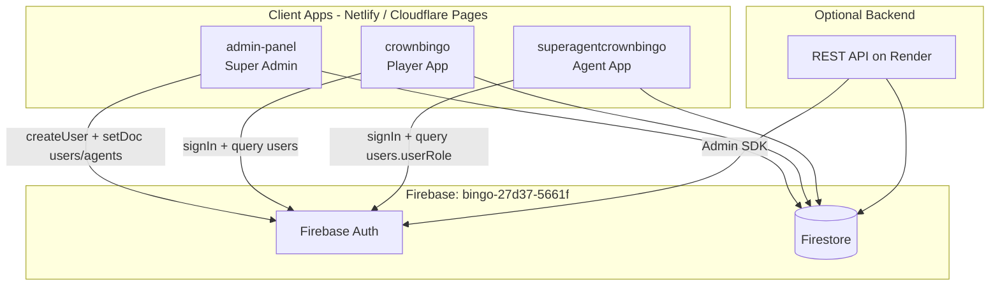
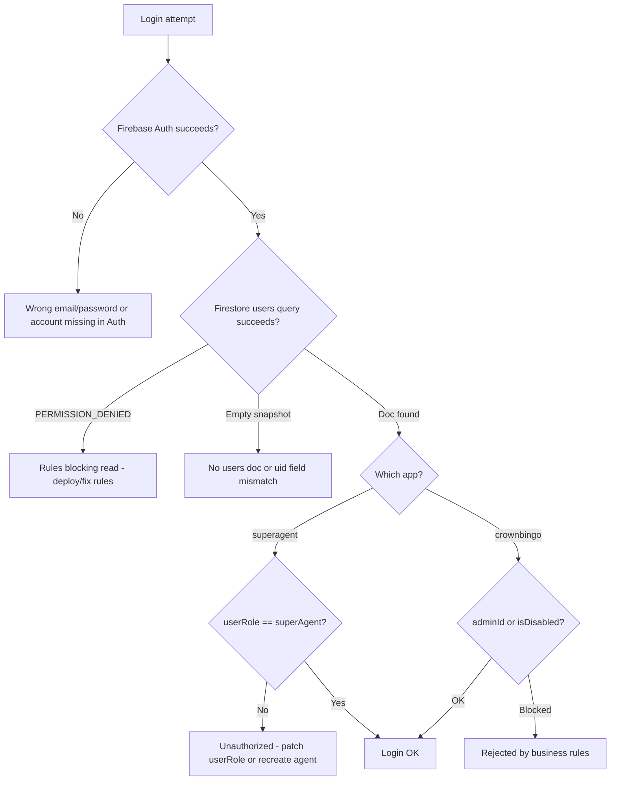

# Crown bingo system analysis
_Exported on 6/5/2026 at 13:46:47 GMT+3 from Cursor (3.6.31)_

---

**User**

Let analyze crown bingo system based on "implementation_plan.md"

---

**Cursor**

I'll read `implementation_plan.md` and map it to the current Crown Bingo codebase structure.


Verifying the plan's claims against the actual login flows, Firebase setup, and Firestore rules.


# Crown Bingo System Analysis (based on `implementation_plan.md`)

I cross-checked the implementation plan against the repo. Below is a verified picture of the system, what the plan gets right, what it misses, and what to do next.

---

## System Architecture



| App | URL (from plan) | Role | Source in repo |
|-----|-----------------|------|----------------|
| **admin-panel** | crown-bingo-admin.pages.dev | Creates users/agents, settings, audit | Full React source (`admin-panel/src/`) |
| **crownbingo** | crown-bingo.pages.dev | Player bingo game | Pre-built bundle only (`main.3fbd7db3.js`) |
| **superagentcrownbingo** | crown-bingo-super-agent.pages.dev | Agent dashboard | React source (`src/`) + deployed bundle (`main.d2281d5f.js`) |

All three apps target the unified Firebase project **`bingo-27d37-5661f`**.

---

## The Login Problem (from the plan)

**Symptom:** Users/agents created in the admin panel cannot log into the player or agent apps.

**Shared login pattern (all apps):**

1. `signInWithEmailAndPassword` → Firebase Auth
2. Query Firestore: `users` where `uid == auth.uid`
3. App-specific gate:
   - **crownbingo:** reject if `adminId` matches a hardcoded admin UID, or `isDisabled`
   - **superagent:** require `userRole == 'superAgent'`

---

## Validating the Plan’s Root Causes

### Bug #1 — Duplicate Firebase init (superagent) — **Partially accurate**

| Location | Status |
|----------|--------|
| `superagentcrownbingo/static/js/Components/login.js` | **Still broken** — unconditional `initializeApp()` at line 48 |
| `superagentcrownbingo/src/Components/login.js` | **Already fixed** — imports `db` from `../firebase` |
| **Production bundle** `main.d2281d5f.js` | **Appears fixed** — login uses shared `getAuth()` + `db`, not inline init |

The plan is correct about the stale `static/js/Components/login.js` copy, but **production may already be OK** if the current bundle was built from `src/`. The bundle login flow matches the fixed source:

```58407:58430:superagentcrownbingo/static/js/main.d2281d5f.js
onSubmit: async t => {
    // ...
    const n = nE(),  // getAuth()
    // ...
    const a = yv(Rg(YU, "users"), wv("uid", "==", i.uid)),  // query users via shared db
    // ...
    if ("superAgent" == s.docs[0].data().userRole) {
        // success → /Dashboard
```

**Implication:** Bug #1 is a **dev/reference hazard**, not necessarily the live production blocker — unless an older bundle is deployed.

---

### Bug #2 — Firestore rules not deployed — **High priority, still open**

`AGENTS.md` Phase 5 is still **incomplete**. The repo has `firestore.rules`, but deployment is manual (Console or `firebase deploy`).

Planned rules allow authenticated reads on `users`:

```9:11:firestore.rules
match /users/{userId} {
  allow read, write: if isAuthenticated();
}
```

**Nuance the plan understates:** Firebase does not auto-fall back to deny-all. Whatever is **currently published in the Console** is active — test-mode rules, old permissive rules, or something else. You need to check the Console to know which case you’re in.

**If the new rules are deployed**, login queries on `users` should work for authenticated users. **Post-login** behavior is another story (see gaps below).

---

### Bug #3 — `getAuth()` without instance — **Not a real issue**

Confirmed. `getAuth()` works once the default app exists. Subordinate to Bug #1.

---

### “NOT a Bug” claims — **Confirmed**

**Admin panel user creation** writes the right fields:

```73:96:admin-panel/src/components/pages/AgentManagement.js
const agentData = {
    uid,
    // ...
    userRole: 'superAgent',
    role: 'agent',
    isDisabled: false,
    // ...
};
await setDoc(doc(db, 'users', uid), agentData);
await setDoc(doc(db, 'agents', uid), agentData);
```

**crownbingo `adminId` check** — new users have no `adminId`, so they pass:

```34:38:crownbingo/static/js/pages/login.js
if (userData.adminId === 'cfIbY9MiWIezaY3tmBJSqW3sgUo1') {
    toast.error('Admin access required. Contact Support');
    return;
}
```

---

## Additional Issues (not in the plan)

### 1. Firestore rules are incomplete for real app usage

Apps use collections **not covered** by `firestore.rules`:

| Collection | Used by | In rules? |
|------------|---------|-----------|
| `points` | crownbingo, superagent | **No** → denied by catch-all |
| `history` | Both apps | **No** |
| `jackpotHistory` | crownbingo | **No** |

Catch-all:

```59:62:firestore.rules
match /{document=**} {
  allow read, write: if false;
}
```

**Effect:** Login might succeed, but balance, game history, and agent dashboards can fail with `PERMISSION_DENIED` after login.

---

### 2. Legacy data — missing role fields

`admin-panel/patch.html` and `Settings.js` (`patchMissingRoles`) exist to fix older records missing `role` / `userRole`. That points to a **data migration** problem separate from code bugs:

- Agents without `userRole: 'superAgent'` → superagent shows *"Unauthorized access"*
- Users with no Firestore doc → *"User data not found"*

---

### 3. Admin panel redundant dual Firebase apps

```27:34:admin-panel/src/firebase.js
const app = initializeApp(firebaseConfig);
const crownbingoApp = initializeApp(crownbingoConfig, 'crownbingo');
// Both configs point to the SAME project now
```

User creation uses `crownbingoAuth` but writes to both `db` and `crownbingoDb` (same project). Harmless duplication, not a login blocker.

---

### 4. REST API user creation differs from admin panel

`api/routes/users.js` creates agents in `agents` only — **no `users` doc, no `userRole`**. Superagent login only reads `users`, so API-created agents would fail. Only relevant if you create users via the API, not the admin UI.

---

### 5. Source vs production mismatch

| App | What runs in production | What’s in repo |
|-----|-------------------------|----------------|
| crownbingo | `main.3fbd7db3.js` only | No React `src/` — can’t rebuild without original source |
| superagent | `main.d2281d5f.js` | `src/` + `package.json` — **can rebuild** with `npm run build` |
| admin-panel | React build | Full source |

The plan’s Q1 is answered: **only compiled bundles matter** for crownbingo and superagent in production.

---

## Login Failure Decision Tree



| Error message | Most likely cause |
|---------------|-------------------|
| `Login failed: Firebase App named '[DEFAULT]' already exists` | Stale superagent bundle with duplicate init |
| `Login failed: Missing or insufficient permissions` | Firestore rules blocking `users` read |
| `User data not found` | No `users` doc, or `uid` field missing/wrong |
| `Unauthorized access. User is not a super and agent` | Agent doc exists but `userRole` ≠ `superAgent` |
| `Your account has been disabled` | `isDisabled: true` on user doc |

---

## Recommended Fix Priority

| Priority | Action | Fixes |
|----------|--------|-------|
| **P0** | Check Firebase Console → Firestore Rules (what’s live?) | Confirms if rules are the blocker |
| **P0** | Deploy `firestore.rules` **after extending** rules for `points`, `history`, `jackpotHistory` | Login + post-login features |
| **P1** | Run role patch (`Settings.js` or `patch.html`) on existing users/agents | Legacy data without `userRole` |
| **P1** | Rebuild superagent: `cd superagentcrownbingo && npm install && npm run build` | Sync bundle with fixed `src/` |
| **P2** | Align `static/js/Components/login.js` with `src/` (or remove stale copy) | Avoid future confusion |
| **P2** | Deploy Firestore indexes from `firestore.indexes.json` | Composite queries in admin/dashboard |

---

## Verification Plan (refined)

1. **Firebase Console** — note active Firestore rules (not just whether the repo file exists).
2. **Create a test user** in admin panel → confirm `users/{uid}` has `uid`, `role: 'user'`, no `adminId`.
3. **Create a test agent** → confirm `userRole: 'superAgent'`, `role: 'agent'` in `users/{uid}`.
4. **Login tests** with DevTools Console open:
   - Player: `crown-bingo.pages.dev`
   - Agent: `crown-bingo-super-agent.pages.dev`
5. **After login**, confirm `points` / `history` reads work (will fail if rules gap isn’t fixed).

---

## Bottom Line

The implementation plan correctly identifies the **login architecture** and the **Firestore rules gap** as the main systemic risk. It’s slightly overstated on Bug #1 for **current production** (the bundle looks fixed), and it **doesn’t cover**:

- Missing rules for `points`, `history`, `jackpotHistory`
- Legacy data needing the patch tool
- crownbingo being non-rebuildable from this repo

**Most likely immediate wins:** deploy (and complete) Firestore rules, patch legacy user records, then rebuild/redeploy superagent if login still fails.

If you want to go further, I can draft updated `firestore.rules` for the missing collections, run the superagent rebuild, or walk through a specific login error from DevTools.

---

**User**

Let proceed for for the missing collections

